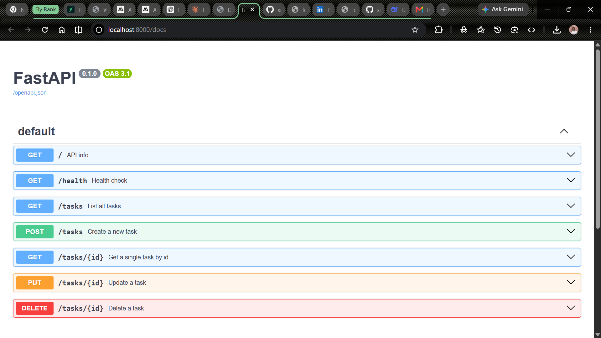
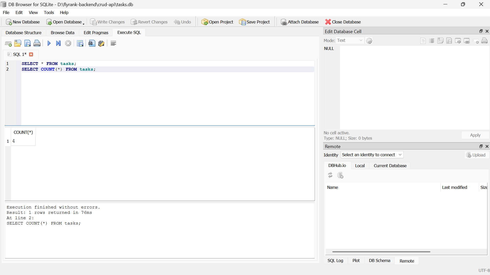

# Task API — FlyRank BE-01 & BE-02 (Week 2 & Week 3)

A to-do task API built with **Python** and **FastAPI**. Started as an in-memory CRUD API (BE-01), then upgraded to use a real **SQLite** database (BE-02) so data survives server restarts.

Built as part of the FlyRank Backend AI Engineering Internship — July 2026 cohort.

## How to run it

From inside the `crud-api` folder:

```bash
python -m venv venv
venv\Scripts\Activate.ps1
pip install fastapi uvicorn
uvicorn main:app --reload
```

Server runs at `http://localhost:8000`. Interactive docs at `http://localhost:8000/docs`.

The database file `tasks.db` is created automatically on first run, with three seed tasks. It is git-ignored, so every clone starts fresh.

## Why SQLite

SQLite was chosen because it needs no separate server or installation — it's a single file (`tasks.db`) that Python's built-in `sqlite3` module can read and write directly. For a small project like this, it gives real persistence (data survives restarts) without any setup overhead, which makes it a natural first step before a full client-server database like PostgreSQL.

## Endpoints

| Method | Path | Description | Success | Errors |
|--------|------|-------------|---------|--------|
| GET | `/` | API info | 200 | — |
| GET | `/health` | Health check | 200 | — |
| GET | `/tasks` | List all tasks | 200 | — |
| GET | `/tasks/{id}` | Get a single task by id | 200 | 404 if not found |
| POST | `/tasks` | Create a new task | 201 | 400 if title missing/empty |
| PUT | `/tasks/{id}` | Update a task's title and done status | 200 | 400 invalid body, 404 if not found |
| DELETE | `/tasks/{id}` | Delete a task | 204 | 404 if not found |

All CRUD operations use parameterized SQL queries (`?` placeholders) — no user input is ever glued directly into a SQL string.

## Example request

```
curl.exe -i http://localhost:8000/tasks/1
```

Response:

```
HTTP/1.1 200 OK
date: Sat, 18 Jul 2026 06:53:21 GMT
server: uvicorn
content-length: 40
content-type: application/json

{"id":1,"title":"Buy milk","done":false}
```

## Swagger UI

All endpoints tested and working via `/docs` — full CRUD cycle (create, list, update, delete) confirmed with "Try it out."



## Database — SQLite

`tasks.db` is created automatically on first run if it doesn't exist. The `tasks` table is also created automatically, with columns `id` (primary key), `title`, and `done`. Three example tasks are seeded only if the table is empty, so restarting the server never duplicates them.

Example query run in DB Browser for SQLite:

```sql
SELECT COUNT(*) FROM tasks;
```

Returned `4` — confirming that a task created earlier through `POST /tasks` had persisted correctly in the database, even after restarting the server.



## Persistence proof

1. Created a task via `POST /tasks`.
2. Stopped the server (`Ctrl+C`) and restarted it (`uvicorn main:app --reload`).
3. Ran `GET /tasks` again — the created task was still present.
4. Opened `tasks.db` directly in DB Browser for SQLite and confirmed the same row existed there, independent of the API.

This is the core difference from BE-01: in Assignment 1, all data lived in a Python list and vanished on every restart. In this version, restarting the server no longer affects stored data — the API layer stayed identical, only the storage layer changed.

## Notes

- BE-01 (Week 2): in-memory storage — data lost on restart.
- BE-02 (Week 3): SQLite storage — data persists on restart. Endpoint behavior and request/response shapes are unchanged from BE-01.
